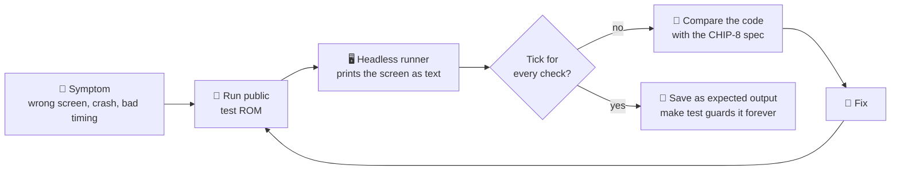
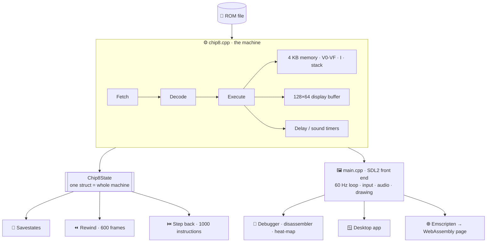
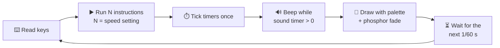

<div align="center">

# 🕹️ CHIP-8 Emulator

**A CHIP-8 / SUPER-CHIP emulator with a time-travel debugger, in C++17 + SDL2, that also runs in your browser.**

Built by **Kevin Mathew** for TatHack '26 · PS1

### 🔴 Live demo: **[kevinmathew47.github.io/CHIP-8-EMULATOR](https://kevinmathew47.github.io/CHIP-8-EMULATOR)**
<sub>Runs in any modern browser, desktop or phone. No install.</sub>

[](https://kevinmathew47.github.io/CHIP-8-EMULATOR)
&nbsp;

&nbsp;

&nbsp;


</div>

---

## ⚡ Quick start

| | |
|---|---|
| 🌐 **Browser** | Open **[kevinmathew47.github.io/CHIP-8-EMULATOR](https://kevinmathew47.github.io/CHIP-8-EMULATOR)**, pick a game, click the screen |
| 🪟 **Windows** | Install [MSYS2](https://www.msys2.org/) → `pacman -S mingw-w64-ucrt-x86_64-gcc mingw-w64-ucrt-x86_64-SDL2 make` → `make` → double-click **`play.bat`** |
| 🐧 **Linux / macOS** | `sudo apt install g++ make libsdl2-dev` (or `brew install sdl2`) → `make` → `./chip8 roms/Tetris.ch8` |
| ✅ **Tests** | `make test`, no window needed |

---

## 🐞 The bugs we fixed

The same test ROMs on the **original** code (left) and our **fixed** code (right):


| | Bug | Symptom | Fix |
|---|---|---|---|
| 🔁 | `00EE` read the stack before moving the pointer | Every subroutine return crashed | Decrement, then read |
| ⏱️ | `SDL_Delay` after **every** instruction; timers ticked per instruction | CPU crawled, timers 10× too fast | One frame of instructions, then timers once at 60 Hz |
| 🙃 | Rows drawn at `31 - y` | Screen upside down | Draw at `y` |
| 🚩 | `>` instead of `>=`, VF written before the result | Wrong carry/borrow flags | `>=`, write VF last |
| 🔢 | BCD tens digit, `FX55/65` off by one, `FX0A` never waits | Wrong scores, lost registers, skipped menus | Spec-correct versions |

➡️ All 17 fixes with line numbers and reasoning: **[TECHNICAL.md](TECHNICAL.md#debugging-phase-bugs-fixed)**

---

## 🧭 How we found and fixed them



---

## 🏗️ Architecture



**Every frame (1/60 s):**



---

## 🖥️ Interface

```
┌──────────────────┬──────────────────────────────────────┬──────────────────┐
│ 01 NOW PLAYING   │ ┌──────────────────────────────────┐ │ 04 EMULATION     │
│  Tetris          │ │                                  │ │  Pause   Reset   │
│  Q ROTATE W LEFT │ │                                  │ │  Slower  Faster  │
│ ┌──┬──┬──┬──┐    │ │           GAME  SCREEN           │ │  Hold to rewind  │
│ │1 │2 │3 │C │    │ │                                  │ │ 05 SAVE STATES   │
│ ├──┼──┼──┼──┤    │ │                                  │ │  Save  Load  ‹0› │
│ │4 │5 │6 │D │    │ │                                  │ │ 06 DEBUGGER      │
│ └──┴──┴──┴──┘    │ └──────────────────────────────────┘ │  Open  Map       │
│ 02 LIBRARY       │  ● RUNNING   ♫ SOUND                 │  Step  Back      │
│  Games           │ SPEED│QUIRKS│PALETTE│DISPLAY│WAVE    │ 07 DISPLAY/SOUND │
│  Super-CHIP      ├──────────────────────────────────────┤  Palette  Mute   │
│  Test ROMs       │ 03 PROOF OF OUR FIXES                │  Test sound      │
│  [Open .ch8]     │  before / after + "Run IBM logo"     │ 08 KEYBOARD      │
└──────────────────┴──────────────────────────────────────┴──────────────────┘
```

Keys the current game uses glow green on the keypad. The desktop app has the same features,
driven by the keyboard (`H` shows every key).

---

## ✨ Features

| Required | | Extra | |
|---|---|---|---|
| ⚡ **Speed control** | `-` `=` · 60 to 60,000 instructions/s | ⏮️ **Time-travel debugger** | `F4` steps *backwards* |
| 💾 **Savestates** | `F5` / `F9` · 10 slots | 🔥 **Memory heat-map** | `F3` · watch code run |
| 🎨 **8 palettes** | `Tab` · Green Screen, Amber CRT, Neon… | 🎮 **Control detection** | shows which keys a game uses |
| | | ⏪ **Rewind** | hold `Backspace` |
| | | 🕹️ **SUPER-CHIP** | 128×64 hi-res games |
| | | 🌐 **Browser version** | same C++ in WebAssembly |

| Time-travel debugging | Memory heat-map |
|---|---|
|  |  |
| **Savestates** | **Palettes** |
|  |  |
| **SUPER-CHIP games** | **Automated tests** |
|  |  |

📸 More: **[all screenshots](screenshots/README.md)**

---

## 🎮 Controls

```
 CHIP-8 keypad     Keyboard           Games
 ┌─┬─┬─┬─┐        ┌─┬─┬─┬─┐          Tetris   Q rotate · W left · E right · A drop
 │1│2│3│C│        │1│2│3│4│          Pong     1/Q left paddle · 4/R right paddle
 │4│5│6│D│   =    │Q│W│E│R│          Eaty     E start · W A S D move
 │7│8│9│E│        │A│S│D│F│
 │A│0│B│F│        │Z│X│C│V│          H in the app shows every key
 └─┴─┴─┴─┘        └─┴─┴─┴─┘
```

| `P` pause | `N` step frame | `F1` debugger | `F6` / `F4` step / back | `F7` breakpoint |
|---|---|---|---|---|
| **`F5` / `F9`** save / load | **`Tab`** palette | **`Backspace`** rewind | **`B`** sound test | **`U`** mute |

---

## 📚 More

- 🔬 **[TECHNICAL.md](TECHNICAL.md)**: every bug with line numbers, design decisions, file-by-file tour
- 📸 **[screenshots/](screenshots/README.md)**: proof images for every feature
- 🤖 **[AI_USAGE.md](AI_USAGE.md)**: how AI tools were used (TatHack Rule 06)
- 📜 Licence: MIT ([LICENSE](LICENSE)) · test ROMs by Timendus (GPL-3.0) · SUPER-CHIP games from the chip8Archive (CC0)

<div align="center"><sub>Built by <b>Kevin Mathew</b> · build <code>KM-CHIP8-9532C2F87939</code></sub></div>
