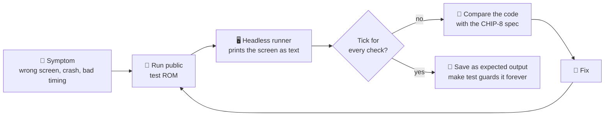
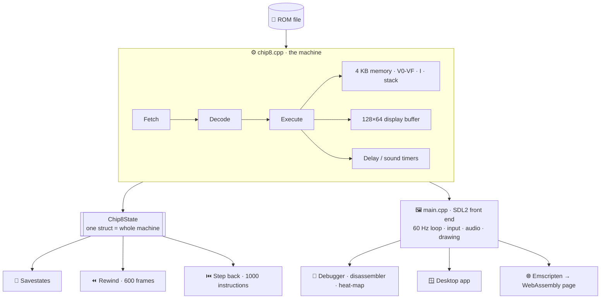
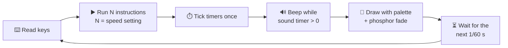

<div align="center">

# 🕹️ CHIP-8 Emulator

**A CHIP-8 / SUPER-CHIP emulator with a time-travel debugger, in C++17 + SDL2, that also runs in your browser.**

Built by **Kevin Mathew** for TatHack '26 · PS1

### 🔴 Live demo: **[kevinmathew47.github.io/CHIP-8-EMULATOR](https://kevinmathew47.github.io/CHIP-8-EMULATOR)**
<sub>Runs in any modern browser, desktop or phone. No install.</sub>

[](https://kevinmathew47.github.io/CHIP-8-EMULATOR)
&nbsp;

&nbsp;

&nbsp;


</div>

---

## ⚡ Quick start

| | |
|---|---|
| 🌐 **Browser** | Open **[kevinmathew47.github.io/CHIP-8-EMULATOR](https://kevinmathew47.github.io/CHIP-8-EMULATOR)**, pick a game, click the screen |
| 🪟 **Windows** | Install [MSYS2](https://www.msys2.org/) → `pacman -S mingw-w64-ucrt-x86_64-gcc mingw-w64-ucrt-x86_64-SDL2 make` → `make` → double-click **`play.bat`** |
| 🐧 **Linux / macOS** | `sudo apt install g++ make libsdl2-dev` (or `brew install sdl2`) → `make` → `./chip8 roms/Tetris.ch8` |
| ✅ **Tests** | `make test`, no window needed |

---

## 📊 Final scorecard

| 🐞 Bugs in the original code | 🔍 Issues caught by our own testing | ❌ Known broken | ✨ Features |
|:---:|:---:|:---:|:---:|
| **15 found · 15 fixed** | **17 found · 17 fixed** | **0** | **3 required + 21 extra** |

## 🐞 The 15 bugs in the original code, all fixed

The same test ROMs on the **original** code (left) and our **fixed** code (right):


| # | Bug | What went wrong | Fix |
|---|---|---|---|
| 1 | `00EE` read the stack before moving the pointer | Every subroutine return crashed | Decrement, then read |
| 2 | `8XY5` borrow used `>` | Wrong flag when values were equal | `>=` |
| 3 | `8XY7` borrow used `>` | Same | `>=` |
| 4 | VF written before the result (`8XY4/5/6/7/E`) | Result lost when VF was the target | Write VF last |
| 5 | `FX0A` never waited for a key | Menus skipped | Wait for press **and** release |
| 6 | `FX33` tens digit not `% 10` | Scores over 99 wrong | `(v / 10) % 10` |
| 7 | `FX55`/`FX65` stopped one register early | Last register lost | Loop to `X` inclusive |
| 8 | `SDL_Delay(16)` after **every** instruction | CPU ran ~60 instead of 600 instructions/s | Run a whole frame, then wait once |
| 9 | Timers ticked per instruction | Game timing ~10× too fast | Tick once per frame (60 Hz) |
| 10 | Frame time `1000/60` truncated to 16 ms | 62.5 Hz instead of 60 Hz | High-resolution timer |
| 11 | Rows drawn at `31 - y` | Screen upside down | Draw at `y` |
| 12 | Keymap stored in `uint8_t` | Keycodes could be cut short | Use `SDL_Keycode` |
| 13 | Tone toggled every 100 samples | 220 Hz instead of 440 Hz | Phase-accurate 440 Hz oscillator |
| 14 | No bounds on memory / key indexes | Out-of-range reads and writes | Mask addresses and keys |
| 15 | README had Tetris' `W`/`A` swapped | Wrong instructions | Verified every key against the ROM |

<details>
<summary><b>🔍 The 17 issues our own testing caught, all fixed</b> (click to expand)</summary>

| Area | Issue | Fix |
|---|---|---|
| Emulator | Accurate 1977 "display wait" made games run below the chosen speed | Fast default profile + exact **COSMAC VIP** profile |
| Emulator | Keys and rewind stuck after alt-tab | Release everything when the window loses focus |
| Emulator | Breakpoints kept after loading another ROM | Cleared on ROM load |
| Emulator | Rewind left a smeared trail | Phosphor fade keeps running while rewinding |
| Emulator | Loading a savestate left ghost pixels | Screen fade reset on load |
| Emulator | Screenshot key wrote to the wrong file in scripted runs | Separate capture path |
| Emulator | SUPER-CHIP games ran at the wrong speed (Eaty looked frozen) | Authors' published speed and quirks, picked by CRC32 |
| Emulator | Blinky needs different quirks than Tetris and Pong | ROM database selects SCHIP quirks automatically |
| Web | Black screen on launch | Main object made `static` (browser leaves `main()` early) |
| Web | Game screen squashed square | Fixed 2:1 aspect, non-resizable canvas |
| Web | Mouse wheel over the screen couldn't scroll the page | Wheel goes to the page unless the debugger is open |
| Web | Browsers block sound until the first click | Audio resumed on the first click or key press |
| Web | Panels collapsed on narrow screens | Stretch rules limited to desktop |
| Web | Short laptop windows fell back to the stacked layout | Three columns kept at every desktop size |
| Web | Black bars beside the screen, small debugger text | Screen fills the monitor width |
| Web | Browser kept serving the old version after updates | Cache refresh documented (`Ctrl+F5`) |
| Repo | Windows line endings would fail `make test` on a fresh clone | `.gitattributes` pins line endings |

</details>

**Known limitations (not bugs):** legacy SUPER-CHIP low-res scrolling isn't modelled (modern mode is) ·
XO-CHIP colour planes and audio patterns aren't implemented · browser savestates last until reload ·
Tetris (1991) has no game-over in the ROM itself.

➡️ Line numbers and full reasoning for every fix: **[TECHNICAL.md](TECHNICAL.md#debugging-phase-bugs-fixed)**

---

## 🧭 How we found and fixed them



---

## 🏗️ Architecture



**Every frame (1/60 s):**



---

## 🖥️ Interface

```
┌──────────────────┬──────────────────────────────────────┬──────────────────┐
│ 01 NOW PLAYING   │ ┌──────────────────────────────────┐ │ 04 EMULATION     │
│  Tetris          │ │                                  │ │  Pause   Reset   │
│  Q ROTATE W LEFT │ │                                  │ │  Slower  Faster  │
│ ┌──┬──┬──┬──┐    │ │                                  │ │  Hold to rewind  │
│ │1 │2 │3 │C │    │ │           GAME  SCREEN           │ │ 05 SAVE STATES   │
│ ├──┼──┼──┼──┤    │ │     (fills the whole monitor)    │ │  Save  Load  ‹0› │
│ │4 │5 │6 │D │    │ │                                  │ │ 06 DEBUGGER      │
│ └──┴──┴──┴──┘    │ │                                  │ │  Open  Map       │
│ 02 LIBRARY       │ └──────────────────────────────────┘ │  Step  Back      │
│  Games           │  ● RUNNING   ♫ SOUND                 │ 07 DISPLAY/SOUND │
│  Super-CHIP      │ SPEED│QUIRKS│PALETTE│DISPLAY│WAVE    │  Palette  Mute   │
│  Test ROMs       │                                      │  Test sound      │
│  [Open .ch8]     │                                      │ 08 KEYBOARD      │
├──────────────────┴──────────────────────────────────────┴──────────────────┤
│ 03 PROOF OF OUR FIXES  (scroll down)                                       │
│  [ before / after image ]   what was wrong · "Run IBM logo" · "Run tests"  │
└────────────────────────────────────────────────────────────────────────────┘
```

Keys the current game uses glow green on the keypad. The desktop app has the same features,
driven by the keyboard (`H` shows every key).

---

## ✨ Features: 3 required + 21 extra

**Required**

| Feature | Key | What it does |
|---|---|---|
| ⚡ Speed control | `-` `=` `0` | 60 to 60,000 instructions per second, changed live |
| 💾 Savestates | `F5` `F9` `[` `]` | Saves the whole machine to a file; 10 slots per game |
| 🎨 Colour palettes | `Tab` | 8 palettes incl. Classic Green Screen, Amber CRT, Neon High-Contrast |

**Extra**

| | Feature | What it does |
|---|---|---|
| 🐛 | **Time-travel debugger** (`F4`) | Steps *backwards* through instructions, restoring the exact machine state |
| 🐛 | **Memory heat-map** (`F3`) | All 4 KB of memory lit up as code runs, data is read and values are written |
| 🐛 | Debugger (`F1`) | Live registers, stack, memory with sprite preview, keypad |
| 🐛 | Breakpoints and stepping (`F7` `F6` `N`) | Stop at an address; step one instruction or one frame |
| 🐛 | Disassembler | Every CHIP-8 and SUPER-CHIP instruction shown as readable assembly |
| 🎮 | **Automatic control detection** | Shows which keys a game uses, even for unknown ROMs |
| 🎮 | Rewind (hold `Backspace`) | Runs the last 10 seconds backwards |
| 🎮 | ROM auto-detection | Recognises games by checksum and applies their correct settings |
| 🎮 | Pause, frame step, reset (`P` `N` `F8`) | Full control over execution |
| 🎮 | Drag-and-drop ROMs | Drop a `.ch8` file on the window to play it |
| 🕹️ | SUPER-CHIP support | 128×64 hi-res, 16×16 sprites, scrolling, big font |
| 🕹️ | 4 quirk profiles (`F2`) | CHIP-8, COSMAC VIP, SUPER-CHIP, XO-CHIP behaviour |
| 📺 | Phosphor fade and scanlines (`G` `L`) | Removes CHIP-8 flicker; optional CRT look |
| 🔊 | 4 sound waveforms, test tone, mute (`M` `B` `U`) | Square, triangle, sine, sawtooth |
| 📸 | Screenshots (`F12`) and help screen (`H`) | Save the screen; see every key |
| 🌐 | **Browser version** | The same C++ compiled to WebAssembly, [live here](https://kevinmathew47.github.io/CHIP-8-EMULATOR) |
| 🌐 | Game library and ROM upload | One-click games, SUPER-CHIP titles and test ROMs, or open your own |
| 🌐 | On-screen touch keypad | Plays on phones and tablets; used keys glow green |
| ✅ | Automated test suite (`make test`) | 13 checks against public test ROMs, no window needed |
| 🎬 | Scripted input and fixed seed | `--press`, `--seed`, `--capture` make any run repeatable |
| 🔏 | Authorship signature | Built-by credit in the app and web page, stamped into every savestate |

| Time-travel debugging | Memory heat-map |
|---|---|
|  |  |
| **Savestates** | **Palettes** |
|  |  |
| **SUPER-CHIP games** | **Automated tests** |
|  |  |

📸 More: **[all screenshots](screenshots/README.md)**

---

## 🎮 Controls

```
 CHIP-8 keypad     Keyboard           Games
 ┌─┬─┬─┬─┐        ┌─┬─┬─┬─┐          Tetris   Q rotate · W left · E right · A drop
 │1│2│3│C│        │1│2│3│4│          Pong     1/Q left paddle · 4/R right paddle
 │4│5│6│D│   =    │Q│W│E│R│          Eaty     E start · W A S D move
 │7│8│9│E│        │A│S│D│F│
 │A│0│B│F│        │Z│X│C│V│          H in the app shows every key
 └─┴─┴─┴─┘        └─┴─┴─┴─┘
```

| `P` pause | `N` step frame | `F1` debugger | `F6` / `F4` step / back | `F7` breakpoint |
|---|---|---|---|---|
| **`F5` / `F9`** save / load | **`Tab`** palette | **`Backspace`** rewind | **`B`** sound test | **`U`** mute |

---

## 📚 More

- 🔬 **[TECHNICAL.md](TECHNICAL.md)**: every bug with line numbers, design decisions, file-by-file tour
- 📸 **[screenshots/](screenshots/README.md)**: proof images for every feature
- 🤖 **[AI_USAGE.md](AI_USAGE.md)**: how AI tools were used (TatHack Rule 06)
- 📜 Licence: MIT ([LICENSE](LICENSE)) · test ROMs by Timendus (GPL-3.0) · SUPER-CHIP games from the chip8Archive (CC0)

<div align="center"><sub>Built by <b>Kevin Mathew</b> · build <code>KM-CHIP8-9532C2F87939</code></sub></div>
