# Technical details: CHIP-8 Emulator (TatHack '26, PS1)

**Built by Kevin Mathew** · build signature `KM-CHIP8-9532C2F87939`

A CHIP-8 / SUPER-CHIP emulator in C++17 and SDL2. We started from the organisers' partially
working codebase, found and fixed its bugs, added the three required features, and then built
a **time-travel debugger** with a live memory heat-map, **automatic control detection**, rewind,
SUPER-CHIP support, a browser version and an automated test suite on top.

### What makes it different

| | |
|---|---|
| **Time-travel debugging** | Step *backwards* through instructions (`F4`): every register, byte of memory and pixel is restored exactly |
| **Live memory heat-map** | Watch all 4 KB light up as the CPU executes, reads and writes (`F3`) |
| **Automatic control detection** | The emulator watches which keys a ROM checks and tells the player, even for ROMs it has never seen |
| **Every fix proven** | 13 automated checks against public test ROMs, and before/after screenshots from the original code |
| **Same code in the browser** | The C++ core compiles to WebAssembly, so the emulator runs in a web page too |

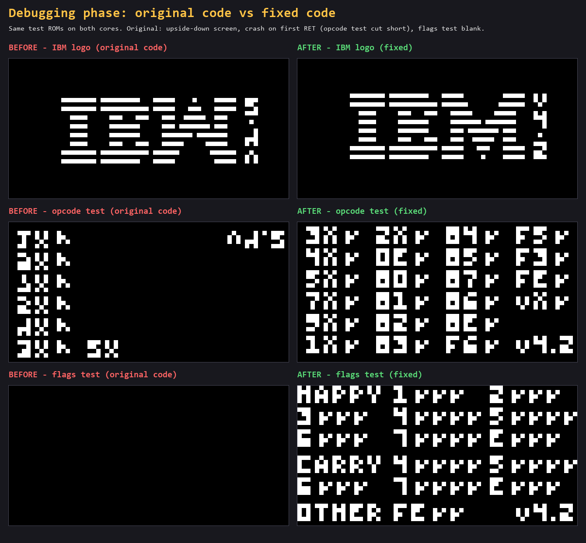

**Contents:** [Quick start](#quick-start) · [Bugs fixed](#debugging-phase-bugs-fixed) · [Standout features](#standout-features) ·
[Required features](#required-features) · [Extra features](#extra-features) · [Controls](#controls) ·
[Testing](#testing) · [How it works](#how-it-works) · [Credits](#credits-and-licences)

---

## Quick start

### Windows (MSYS2)

1. Install [MSYS2](https://www.msys2.org/) (`winget install MSYS2.MSYS2`).
2. In the **MSYS2 UCRT64** terminal, install the toolchain and SDL2:
   ```bash
   pacman -S --needed mingw-w64-ucrt-x86_64-gcc mingw-w64-ucrt-x86_64-SDL2 make
   ```
3. Build:
   ```bash
   cd /path/to/chip8-emulator
   make
   ```
4. Run: double-click **`play.bat`** (starts Tetris), or from PowerShell/cmd:
   ```bat
   play.bat roms\Pong.ch8
   ```

### Linux / macOS

```bash
sudo apt-get install g++ make libsdl2-dev     # Debian/Ubuntu
# sudo pacman -S sdl2                          # Arch
# brew install sdl2                            # macOS
make
./chip8 roms/Tetris.ch8
```

The Makefile gets compiler and linker flags from `sdl2-config`, so the same `make` works on
every platform.

### In the browser (WebAssembly)

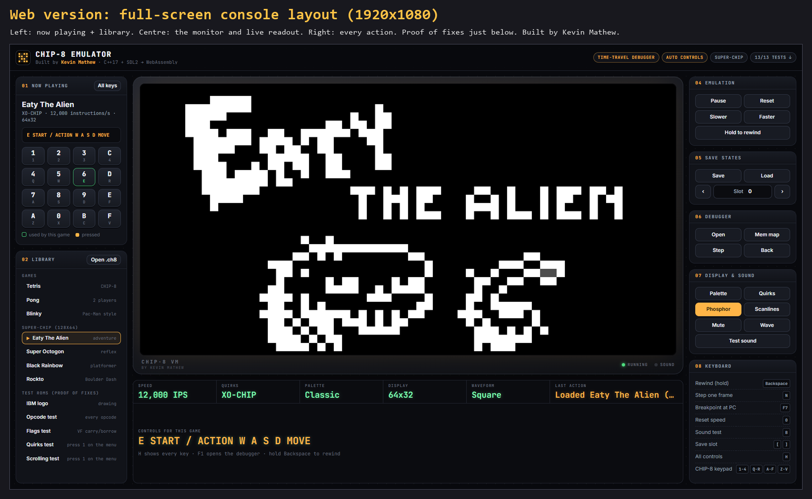

The same C++ code also compiles to WebAssembly with Emscripten. The web page adds:

- a **library** of the bundled games, SUPER-CHIP games and the **test ROMs** (IBM logo, opcode,
  flags, quirks, scrolling), so anyone can re-run the proof of our fixes in the browser;
- a **Now playing** panel with the game's controls and a clickable, touch-friendly **keypad** that
  highlights the keys the game uses;
- grouped buttons for every emulator action (in a browser `F5` reloads the page and `F12` opens
  developer tools, so the buttons matter), including hold-to-rewind, step and step back;
- a live status bar (speed, quirks, palette, resolution, a note that lights up when the game beeps);
- an **Open .ch8** button to play your own ROMs, and the before/after comparison of our bug fixes.

```bash
# once: install the Emscripten SDK (https://emscripten.org/docs/getting_started/downloads.html)
git clone https://github.com/emscripten-core/emsdk.git && cd emsdk
./emsdk install latest && ./emsdk activate latest && source ./emsdk_env.sh   # emsdk_env.bat on Windows
# then, in this repository:
make web                       # or on Windows: web/build.bat
python -m http.server 8000 --directory web/build   # open http://localhost:8000
```

`web/build/` (HTML, JS, a roughly 800 KB `.wasm` file and the bundled ROMs) can be hosted on any static
host such as GitHub Pages. Savestates in the browser last until the page is reloaded.

### Command-line options

```
./chip8 <rom> [--quirks chip8|cosmac|schip|xochip] [--speed N] [--palette 0-7]
              [--scanlines] [--debugger] [--break ADDR] [--help-overlay]
              [--press KEY@FRAME[:HOLD]] [--seed N] [--capture FRAMES OUT.bmp]
```

`--press` replays key presses at given frames, `--seed` fixes the random sequence and `--capture`
saves a screenshot and exits, so any session can be reproduced exactly. Every image in
[`screenshots/`](screenshots/) was made this way from the real emulator.

---

## Debugging phase: bugs fixed

Line numbers refer to the **original** files in the organisers' first commit. Every fix is
verified by the test ROMs in `make test` (see [Testing](#testing)).

### CPU opcode execution (`src/chip8.cpp`)

| # | Where (original) | Bug | Symptom | Fix and why it is correct |
|---|---|---|---|---|
| 1 | `00EE`, lines 87–88 | `pc = stack[sp]; sp--;` reads the stack *before* moving the pointer back. `2NNN` pushes and then increments, so `stack[sp]` is always the empty slot above the return address | Every subroutine return jumped to a garbage address. The opcode test ROM crashes on its first `RET` | Decrement first, then read (`sp--; pc = stack[sp];`): the exact reverse of the push |
| 2 | `8XY5`, line 151 | Borrow flag used `>` | `VF` was 0 when `VX == VY`, but no borrow happens then | Use `>=`. The spec says VF = 1 when there is **no** borrow, i.e. `VX >= VY` |
| 3 | `8XY7`, line 161 | Same `>` vs `>=` mistake for `VY - VX` | Same wrong flag on equal values | Use `VY >= VX` |
| 4 | `8XY4/5/6/7/E`, lines 145–166 | `VF` written **before** the result | When `VF` itself is the target (`8FY4` etc.) the flag overwrote the result, or the result overwrote the flag | Compute the flag into a temporary, write the result, then write `VF` last. The flags test ROM checks exactly this case |
| 5 | `FX0A`, lines 246–255 | `pc += 2` ran whether or not a key was pressed | "Wait for key" never waited; games skipped their menus | Only advance when a key is released (original COSMAC VIP behaviour); otherwise re-run the instruction |
| 6 | `FX33`, line 277 | Tens digit stored as `value/10` | For 123 the tens digit was 12 instead of 2, so scores above 99 displayed wrongly | `(value/10) % 10` |
| 7 | `FX55`/`FX65`, lines 283 and 289 | Loop condition `i < X` | The last register (`VX`) was never stored or loaded | `i <= X`. The range is V0 to VX **inclusive** |

### Main loop timing and rendering (`src/main.cpp`, `src/chip8.cpp`)

| # | Where (original) | Bug | Symptom | Fix and why it is correct |
|---|---|---|---|---|
| 8 | `main.cpp` lines 139–141 | `SDL_Delay(16)` **inside** the 10-instruction loop | 10 instructions per 160 ms, about 60 per second instead of 600: everything crawled | Run a whole frame of instructions, then wait once for the remainder of the 1/60 s frame |
| 9 | `chip8.cpp` lines 305–309 | Delay and sound timers counted down once **per instruction** | Timers ran about 10x too fast, so game timing and sounds were wrong | Timers are specified at 60 Hz, so they now tick once per frame in `update_timers()` |
| 10 | `main.cpp` frame pacing | `1000/60` truncates to 16 ms | 62.5 Hz instead of 60 Hz | Pace frames with `SDL_GetPerformanceCounter` for an exact 60 Hz |
| 11 | `main.cpp` line 67 | Rows drawn at `(31-y)` | The whole screen was upside down | Draw row `y` at `y` |
| 12 | `main.cpp` line 20 | `uint8_t keymap[]` stores `SDL_Keycode` values | Keycodes above 255 are truncated, which risks wrong key matches | Store `SDL_Keycode` |
| 13 | `main.cpp` line 48 | Square wave toggled every 100 samples at 44.1 kHz | 220 Hz tone although the README says 440 Hz | Phase-accumulator oscillator at exactly 440 Hz (and now 4 selectable waveforms) |

### Robustness and documentation

| # | Where (original) | Bug | Symptom | Fix |
|---|---|---|---|---|
| 14 | `DXYN`, `FX33`, `FX55`, `FX65`, `EX9E`, `EXA1` | Memory addresses and key indexes were not bounded | Unusual values of `I`/`VX` read or wrote past the end of the arrays | Addresses masked to 12 bits (`& 0xFFF`), key indexes to 4 bits |
| 15 | `README.md` | Tetris controls listed `W` as drop and `A` as left | Players pressed the wrong keys | Verified by pressing every key against the ROM: `W` left, `A` drop |

**Total: 15 bugs in the original code, 15 fixed.**

### Issues caught by our own testing (17, all fixed)

These were not in the original code; they came up while we built and tested new work.

| # | Area | Issue | Fix |
|---|---|---|---|
| 1 | Emulator | The exact 1977 "display wait" made games run below the chosen speed (Pong ran 6.3 of 10 requested instructions per frame) | Fast **CHIP-8** default plus an exact **COSMAC VIP** profile |
| 2 | Emulator | Keys and rewind stayed held after alt-tab (the key-up went to another window) | Release all keys when the window loses focus |
| 3 | Emulator | Breakpoints survived loading a different ROM | Cleared on ROM load |
| 4 | Emulator | Rewind left a smeared trail because the phosphor fade froze | Fade keeps running while rewinding |
| 5 | Emulator | Loading a savestate left faint ghost pixels | Phosphor buffer reset on load |
| 6 | Emulator | `F12` in a scripted `--capture` run wrote to the capture file | Separate screenshot path |
| 7 | Emulator | SUPER-CHIP games ran at 30 instead of their authors' 200 instructions per frame (Eaty looked frozen) | Published speed and quirks applied by CRC32 |
| 8 | Emulator | Blinky only works with SUPER-CHIP shift/load behaviour | ROM database selects it automatically |
| 9 | Web | Black screen: in the browser `main()` returns early and the app object lived on its stack | Made `static` |
| 10 | Web | Canvas followed the page size and became square | Fixed-size window, CSS 2:1 aspect ratio |
| 11 | Web | SDL captured the mouse wheel, so the page couldn't scroll over the screen | Wheel passed to the page unless the debugger is open |
| 12 | Web | Browsers keep audio suspended until user input | Audio context resumed on the first click or key |
| 13 | Web | Panels collapsed to zero height on narrow screens | Flex-grow rules limited to the desktop layout |
| 14 | Web | Windows shorter than 700 px (laptops with toolbars, display scaling) fell back to the stacked layout | Width-only breakpoint, compact tiers for short windows |
| 15 | Web | Screen capped by height left black bars and small debugger text | Screen takes the height first; proof panel scrolls |
| 16 | Web | Browsers served the cached old build after updates | Documented `Ctrl+F5`; verified with cache-bypassing reloads |
| 17 | Repo | Git converted line endings on Windows clones, so `make test` would fail | `.gitattributes` pins LF for text, CRLF for `.bat` |

### Known limitations

- Legacy SUPER-CHIP low-res scrolling (half-pixel) is not modelled; modern mode is.
- XO-CHIP is partial: scrolling and quirks work, colour planes and audio patterns do not.
- Browser savestates live in memory and are lost on reload.
- Linux and macOS builds use the standard `sdl2-config` flow but were not tested on real machines.

---

## Required features

### 1. Configurable emulation speed

`-` / `=` step through 60 to 60,000 instructions per second while the game runs; `0` resets to
600. The current speed is shown on screen and in the title bar. `--speed N` sets it at launch.

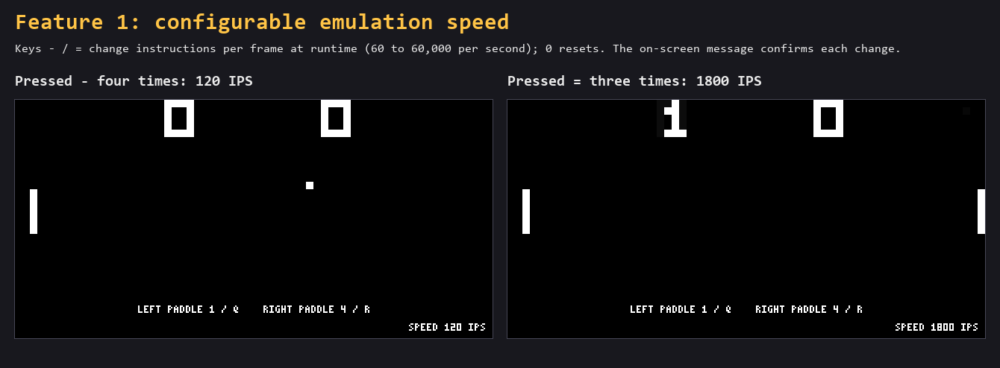

### 2. Savestates

`F5` saves and `F9` loads; `[` / `]` choose one of 10 slots per ROM. A savestate holds **all**
machine state: 4 KB memory, V0–VF, I, PC, stack and SP, both timers, the display, resolution
mode and SUPER-CHIP flag registers. Files go to `saves/<rom>.slotN.c8s` with a magic header
and version byte, so corrupt or old files are rejected instead of loaded.

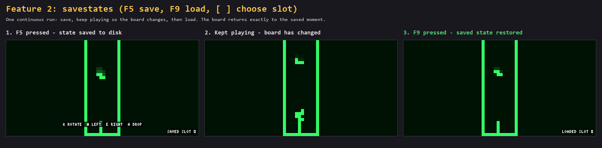

### 3. Colour palettes

`Tab` cycles 8 palettes: **Classic**, **Classic Green Screen**, **Amber CRT**,
**Neon High-Contrast**, Game Boy, Ice, Paper and Hot Pink. `--palette N` picks one at launch.

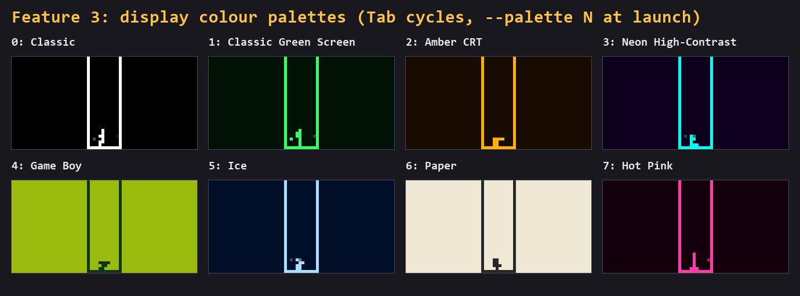

---

## Standout features

### Time-travel debugging

While the debugger (`F1`) is open, the complete machine state before each instruction is kept
(the last 1000). `F6` steps forward, **`F4` steps backwards**, undoing the last instruction
exactly, including memory, the screen and timers. The register panel shows how many steps back
are available. When you hit a bug, you can go back and watch how the program got there.

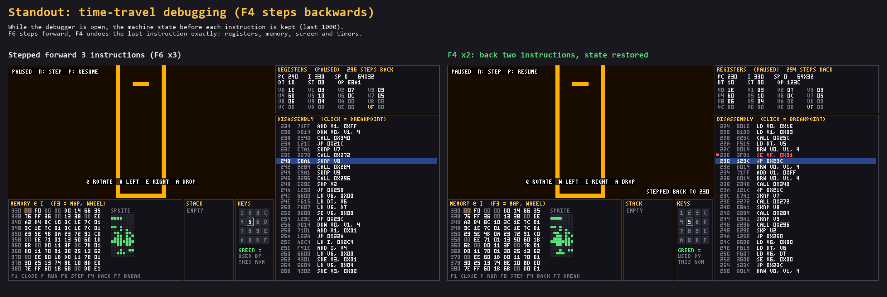

### Live memory heat-map

`F3` switches the debugger's memory panel to a map of all 4096 bytes. Each cell lights up blue when
executed, green when read as data (sprites, `FX65`) and red when written (`FX33`, `FX55`), then
fades over about half a second. White marks PC and yellow marks I. You can see a game's main loop,
its sprite tables and its variables at a glance.

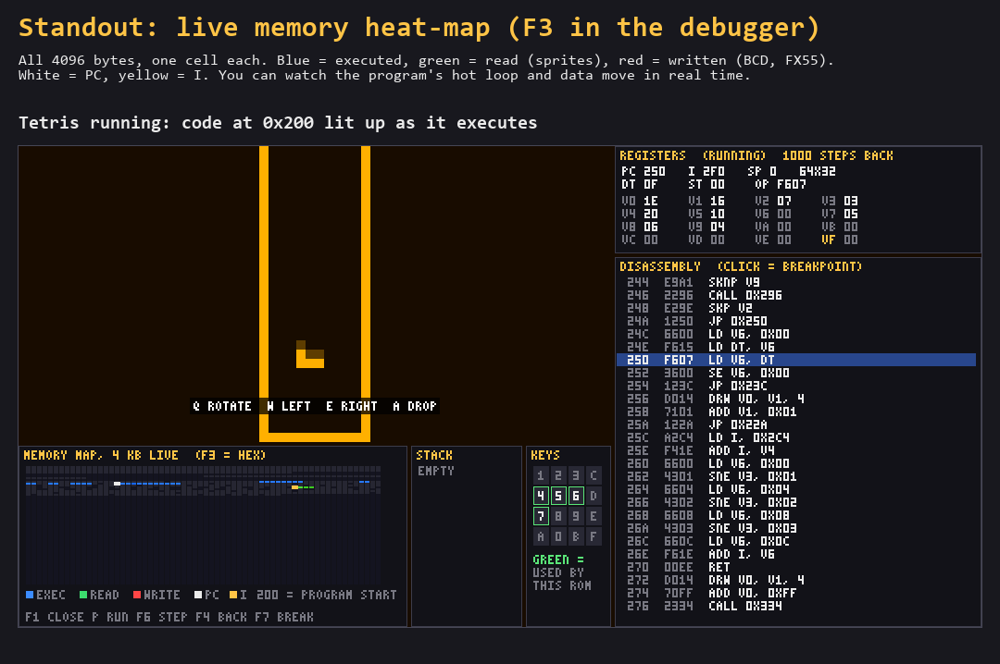

### Automatic control detection

Every CHIP-8 game uses different keys, and ROM files come with no instructions. The CPU records
each key the program checks (`EX9E`, `EXA1`) and whether it waits for any key (`FX0A`):

- **Known games** show controls we verified by pressing every key against the ROM.
- **Unknown ROMs** show `DETECTED KEYS: ...` as soon as the program starts reading them.
- The debugger's keypad outlines the keys this ROM uses in green, and the help screen (`H`) lists them.

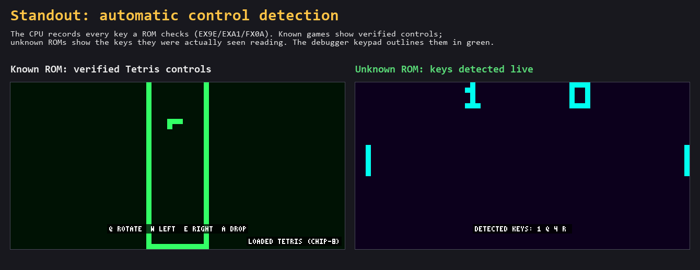

## Extra features

| Feature | Keys | What it does |
|---|---|---|
| **Debugger** | `F1` | Live registers, disassembly around PC, memory at `I` with a sprite preview, call stack, keypad |
| **Breakpoints and stepping** | click a line, `F7`, `F6`, `F4`, `N` | Stop at an address; step forward or **backward** one instruction, or one frame |
| **Memory heat-map** | `F3` | Live view of executed / read / written memory |
| **Disassembler** | (in the debugger) | All CHIP-8 and SUPER-CHIP instructions in Cowgod syntax |
| **Rewind** | hold `Backspace` | Up to 10 seconds back, with a progress bar |
| **SUPER-CHIP** | automatic | 128x64 hi-res, 16x16 sprites, scrolling, big font, RPL flags, exit |
| **Quirk profiles** | `F2` | CHIP-8, COSMAC VIP, SUPER-CHIP, XO-CHIP |
| **ROM auto-detection** | automatic | Known ROMs (by CRC32) get the right quirks and speed |
| **Phosphor fade and scanlines** | `G`, `L` | Removes CHIP-8 flicker; optional CRT scanlines |
| **Sound waveforms** | `M` | Square, triangle, sine, sawtooth |
| **Pause / reset / screenshot** | `P`, `F8`, `F12` | Screenshots go to `captures/` |
| **Drag and drop** | drop a `.ch8` file | Loads a new ROM without restarting |
| **Browser version** | `make web` | WebAssembly build with a ROM picker and file upload ([details](#in-the-browser-webassembly)) |
| **Scripted input** | `--press KEY@FRAME` | Replays key presses for repeatable demos and screenshots |
| **Resizable window** | drag the window edge | Scales cleanly |

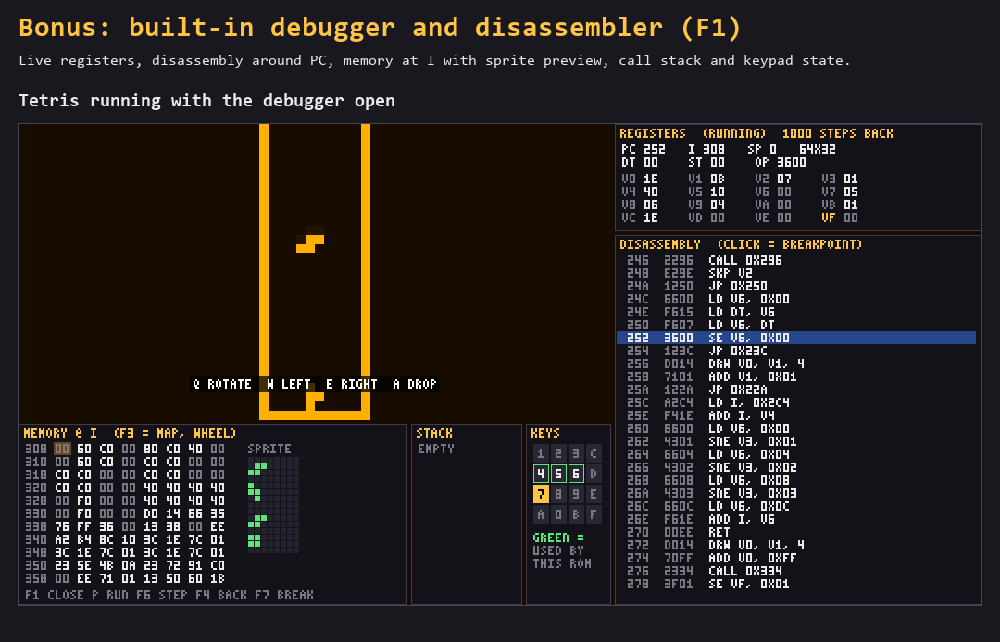

| Rewind | SUPER-CHIP games |
|---|---|
| 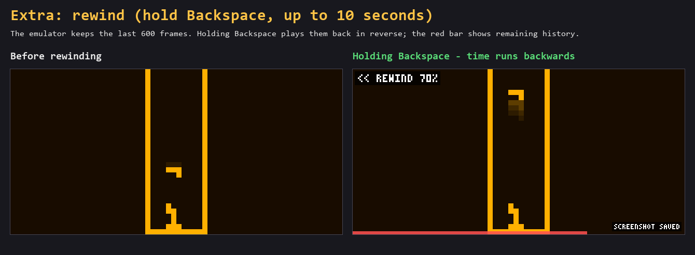 | 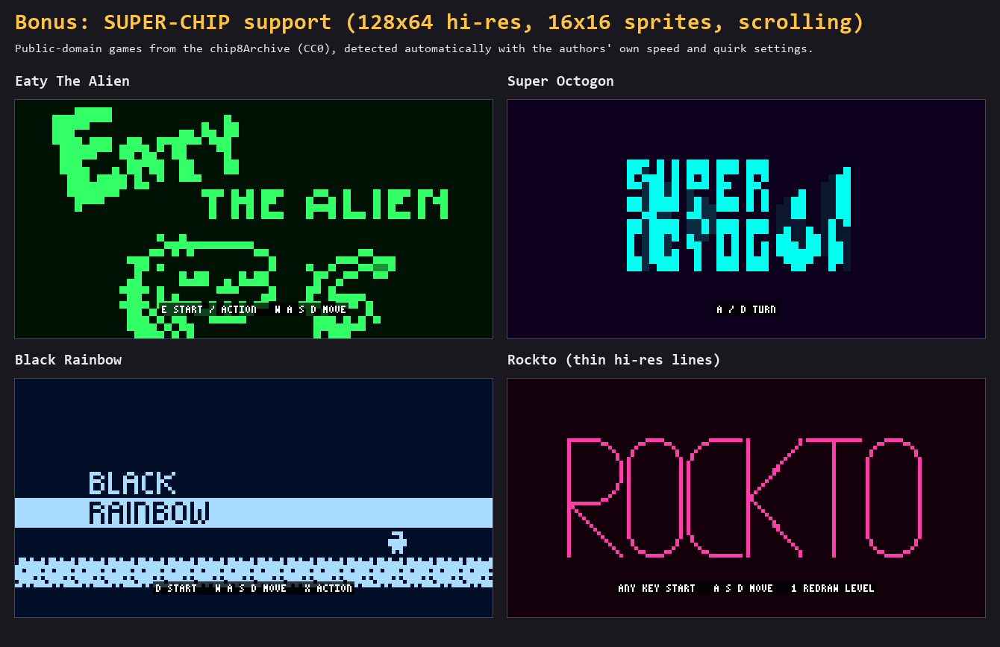 |

More evidence: [breakpoint](screenshots/08_breakpoint.png) ·
[CRT effects](screenshots/12_crt_effects.png) · [ROM auto-detection](screenshots/13_rom_autodetect.png) ·
[help overlay](screenshots/11_help_overlay.png) · [all screenshots](screenshots/README.md)

---

## Controls

Press `H` in the emulator for this list.

**CHIP-8 keypad**

```
Keypad        Keyboard
1 2 3 C       1 2 3 4
4 5 6 D       Q W E R
7 8 9 E       A S D F
A 0 B F       Z X C V
```

**Emulator**

| Key | Action | Key | Action |
|---|---|---|---|
| `P` | Pause / resume | `F1` | Debugger |
| `N` | Step one frame (paused) | `F6` | Step one instruction |
| `-` `=` `0` | Slower / faster / reset | `F7` | Breakpoint at PC |
| `F4` | Step back one instruction | `F3` | Memory heat-map |
| hold `Backspace` | Rewind | `F2` | Quirk profile |
| `F5` / `F9` | Save / load state | `F8` | Reset ROM |
| `[` `]` | Change save slot | `F12` | Screenshot |
| `Tab` | Palette | `G` / `L` | Phosphor / scanlines |
| `M` | Sound waveform | `U` | Mute |
| `H` | Help | | |
| `Esc` | Quit | | |

**Games:** every control below was verified by running the ROM, pressing each of the 16 keys on
identical copies of the machine (same random seed), and checking which keys the program reads
and which change the screen. The emulator shows these on screen when a game starts.

| Game | Controls | Settings (automatic) |
|---|---|---|
| Pong | `1`/`Q` left paddle, `4`/`R` right paddle | CHIP-8, 600 IPS |
| Tetris | `Q` rotate, `W` left, `E` right, `A` drop | CHIP-8, 600 IPS |
| Blinky | `V` start, `3` up, `E` down, `A` left, `S` right | SUPER-CHIP quirks, 1200 IPS |
| Eaty The Alien | `E` start / action, `W` `A` `S` `D` move | XO-CHIP quirks, 12000 IPS |
| Super Octogon | `A` / `D` turn | SUPER-CHIP quirks, 12000 IPS |
| Black Rainbow | `D` start, `W` `A` `S` `D` move, `X` action | XO-CHIP quirks, 1200 IPS |
| Rockto | any key to start, `A` `S` `D` move one step per press, `1` redraws the level | XO-CHIP quirks, 900 IPS |

The original README had Tetris' `W` and `A` swapped. Tetris also has **no game-over**: its spawn
code at `0x22E` detects the collision but just moves the new piece up one row and carries on (see
the [breakpoint screenshot](screenshots/08_breakpoint.png)). The SUPER-CHIP games use the speed and
quirk settings their authors published in the chip8Archive.

---

## Testing

```bash
make test
```

Runs without a window or SDL. It builds small test programs against the emulator core and checks:

- The [Timendus CHIP-8 test suite](https://github.com/Timendus/chip8-test-suite) ROMs: IBM logo,
  opcode test, flags test, quirks test (CHIP-8, SUPER-CHIP, XO-CHIP) and scrolling test (low and
  high resolution). Each final screen must match a verified output in `tests/expected/`.
- A savestate round-trip: save, run on, load, re-run, and check the screen is identical. Corrupt
  files must be rejected.
- The disassembler on every instruction.
- `FX0A` waiting for key release.

Beyond `make test`, we checked every emulator hotkey with a scripted run (`--press`) and read back the
emulator's own responses, and verified each game's controls as described under [Controls](#controls).

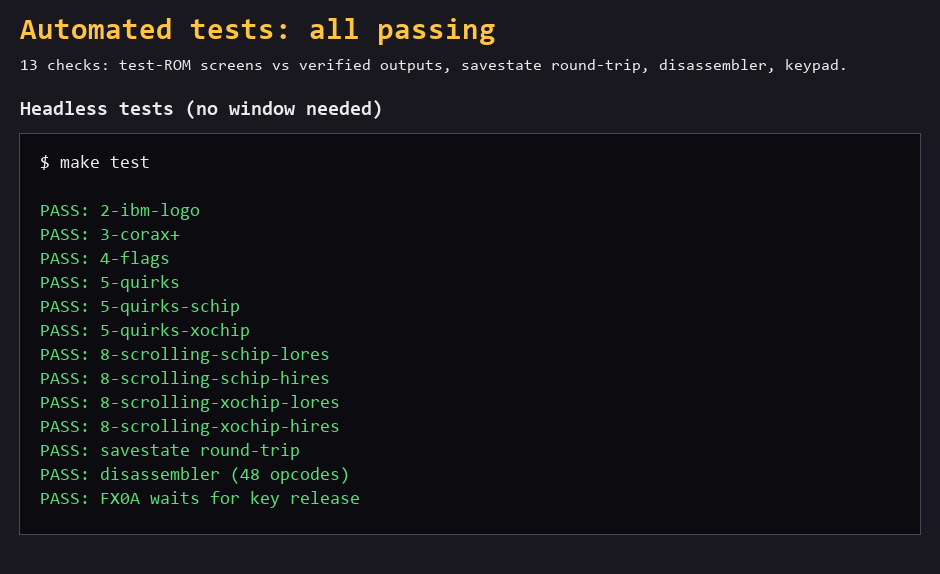

---

## How it works

| File | Role |
|---|---|
| `src/chip8.h/.cpp` | The machine: memory, registers, the fetch/decode/execute switch, quirk profiles, SUPER-CHIP display, savestates |
| `src/main.cpp` | SDL front end: 60 Hz loop (or the browser's frame callback in the web build), input, audio, rendering, rewind buffer, hotkeys, command-line options |
| `web/shell.html` | Web page for the WebAssembly build: ROM picker, file upload, action buttons |
| `src/debugger.h/.cpp` | Debugger panels, breakpoints and mouse handling |
| `src/disasm.h/.cpp` | Opcode to assembly text |
| `src/text.h/.cpp` | A 3x5 bitmap font so on-screen text needs no font library |
| `tests/` | Headless test runners, test ROMs and expected outputs |

Design notes:

- **One display buffer for both resolutions.** The screen is always stored as 128x64; in
  low-res mode each pixel covers a 2x2 block. The renderer, phosphor effect, savestates and
  rewind never need to know which mode a ROM is in.
- **Savestates and rewind share one struct.** `Chip8State` is plain data, so the rewind buffer
  is just a `std::deque` of the last 600 states (about 7 MB), and a savestate file is the same
  struct behind a header.
- **Quirks are data, not `if` chains.** Each profile is a row of booleans (`vf_reset`,
  `memory_increment`, `shift_uses_vy`, `jump_uses_vx`, `clipping`, `display_wait`) that the
  opcodes consult.
- **Recording without slowing the game.** Key checks and memory accesses are recorded with a bit
  mask and three 4 KB arrays; per-instruction history for stepping back is only kept while the
  debugger is open.
- **No new dependencies.** The debugger and all on-screen text are drawn with SDL rectangles
  and our own font, so the project still needs only SDL2.

### CHIP-8 system summary

- **Memory:** 4 KB. `0x000–0x1FF` holds the fonts (small font at `0x000`, SUPER-CHIP big font at
  `0x050`); programs load at `0x200`.
- **Registers:** V0–VF (VF is the flag register), 16-bit I and PC, 16-level stack.
- **Timers:** delay and sound, both 60 Hz.
- **Display:** 64x32 (128x64 in SUPER-CHIP hi-res), XOR drawing with collision in VF.

---

## Credits and licences

- **Author:** Kevin Mathew. Every build shows this in the window title, help screen and web page, and
  stamps `BUILT BY KEVIN MATHEW KM-CHIP8-9532C2F87939` into the emulated machine's reserved memory
  at `0x160` (visible in the debugger and inside every savestate file). `chip8 --version` prints it too.

- Emulator code: MIT, see [`LICENSE`](LICENSE). Starting codebase provided by the TatHack '26 organisers.
- `tests/roms/`: Timendus' CHIP-8 test suite, GPL-3.0, unmodified, used only as test data
  ([details](tests/roms/README.md)).
- `roms/schip/`: games from John Earnest's chip8Archive, CC0 ([details](roms/schip/README.md)).
- `roms/Pong.ch8`, `Tetris.ch8`, `Blinky.ch8`: provided with the original repository.
- AI tools were used during development; see [`AI_USAGE.md`](AI_USAGE.md).
